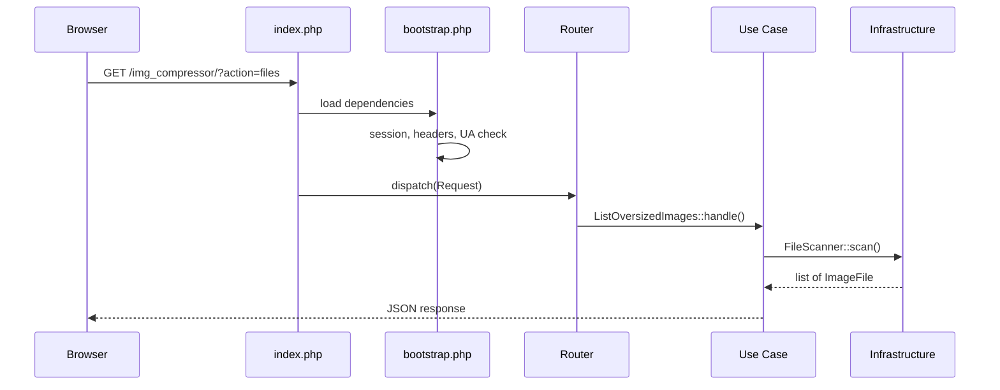

# Architecture

This document explains the design of **Image Debt Cleaner** — why it is structured this way, what trade-offs were made, and how to extend it safely.

---

## Design goals

The tool must satisfy constraints that ruled out a typical framework stack:

| Constraint | Implication |
|------------|-------------|
| Drop into any existing PHP project | Single folder, no global app changes |
| Zero runtime dependencies | No Composer packages required in production |
| No database | Filesystem is the source of truth |
| No ImageMagick / GD pipeline | Compression preview runs in the browser |
| Admin-only, low traffic | Simple session auth is sufficient |

The architecture optimizes for **clarity, safety, and incremental change** — not for microservices or enterprise patterns.

---

## Layered structure

```
img_compressor/
├── index.php              # Front controller (entry point)
├── bootstrap.php          # Wiring: config, autoload, dependencies
├── config.php             # Deployment settings
├── views/
│   └── app.php            # HTML shell (presentation)
├── src/
│   ├── Config/            # Typed configuration access
│   ├── Domain/            # Pure business objects (no I/O)
│   ├── Application/       # Use cases (one action = one class)
│   ├── Http/              # Request, response, routing
│   └── Infrastructure/    # Filesystem, session, security, i18n
├── lang/                  # Translation files
└── assets/                # CSS, JS, backups
```

### Dependency rule

```
Http  →  Application  →  Domain
              ↓
        Infrastructure
```

- **Domain** never reads `$_GET`, `$_POST`, or the filesystem.
- **Application** orchestrates use cases; it does not render HTML.
- **Infrastructure** handles I/O and platform concerns.
- **Http** parses requests and dispatches to the correct use case.

---

## Request flow



For the default page (no `action`), `Router` falls through to `ShowApp`, which renders `views/app.php`.

---

## Layer responsibilities

### Config — `AppConfig`

Wraps `config.php` + optional `config.local.php` into typed accessors (`scanRoots()`, `minFileSize()`, `isBackupEnabled()`, …).

**Why:** Stops raw `$config['key']` from spreading through every function. Makes defaults explicit and testable.

### Paths — `AppPaths`

Resolves all URLs and filesystem roots dynamically so the tool works in any subdirectory:

| Method | Purpose |
|--------|---------|
| `documentRoot()` | Web root — from `document_root` config, `$_SERVER['DOCUMENT_ROOT']`, or scan-path walk-up |
| `appBasePath()` | URL prefix for this tool — from `base_path` config or `SCRIPT_NAME` |
| `compressorRelativePath()` | Tool folder relative to document root — used to exclude self from scans |
| `fileUrl()` | Public URL for a scanned image |

`scan_paths` are always relative to `documentRoot()`, not the tool's parent folder.

### Domain — `ImageFile`, `ByteFormatter`

Value objects with no side effects. `ImageFile::toListArray()` shapes API output.

**Why:** Scan results and display formatting are business concepts, not HTTP or filesystem details.

### Application — use cases

| Class | Responsibility |
|-------|----------------|
| `ListOversizedImages` | Scan, paginate, return file list JSON |
| `SaveCompressedImage` | Validate, backup, write optimized file |
| `ShowApp` | Render the HTML shell |

**Why one class per action:** Each endpoint has a single reason to change. New features (e.g. audit log) add a class — they do not grow a god file.

### Http — `Request`, `JsonResponse`, `Router`

- `Request::fromGlobals()` isolates superglobals.
- `JsonResponse::send()` is the only JSON exit path.
- `Router` maps `?action=` to use cases.

**Why:** Replaces 40 lines of `if ($action === …)` with a declarative dispatch table inside one class.

### Infrastructure

| Class | Responsibility |
|-------|----------------|
| `AppPaths` | Base paths, asset URLs, API URL |
| `PathGuard` | **Security boundary** — all path validation |
| `FileScanner` | Recursive scan of configured roots |
| `BackupStore` | Timestamped backups before overwrite |
| `SessionAuth` | Login, CSRF, session, UA check |
| `SecurityHeaders` | CSP, X-Frame-Options, etc. |
| `I18n` | Locale resolution and translation |

---

## Security model

### PathGuard as the single gate

Every filesystem operation passes through `PathGuard`:

1. `normalizeRelativePath()` — reject `..`, null bytes, empty paths
2. `resolvePublicPath()` — `realpath()` under project public root
3. `isPathInScanRoots()` — file must live inside configured `scan_paths`
4. `assertBackupPathSafe()` — backups cannot escape `backup_dir`

No use case calls `file_put_contents()` without prior `PathGuard` checks.

### Client-side compression, server-side trust boundaries

The browser compresses via Canvas and sends base64 JPEG. The server:

- Validates MIME prefix (`data:image/jpeg;base64,…`)
- Enforces `max_upload_bytes`
- Verifies path + CSRF before write

The server does **not** re-encode images. This is intentional: zero image libraries, predictable deployment.

### Authentication layers

1. **User-Agent filter** — obscurity layer; not a substitute for password
2. **Password** — bcrypt hash preferred (`password_hash` in config)
3. **Session** — httponly, SameSite=Strict, configurable lifetime
4. **CSRF** — required on login and save
5. **Rate limiting** — session-based lockout after failed logins

---

## What we deliberately did NOT add

| Omitted | Reason |
|---------|--------|
| Laravel / Symfony | Breaks drop-in deployment; adds Composer |
| Database index of images | Filesystem scan is correct for an occasional admin tool |
| Server-side image processing | Would require GD/ImageMagick; client preview already works |
| DI container | Manual wiring in `bootstrap.php` is 30 lines — sufficient |
| PSR-4 Composer autoload | Custom autoloader keeps production dependency-free |

---

## Extension guide

### Add a new API endpoint

1. Create `src/Application/YourFeature.php`
2. Register the action in `src/Http/Router.php`
3. If it touches files, route through `PathGuard`

### Add scan caching (when needed)

Add `Infrastructure/ScanCache.php` used by `FileScanner`. Invalidate on directory mtime or TTL. Do not add Redis.

### Add tests

```
tests/
├── Unit/PathGuardTest.php
├── Unit/ImageFileTest.php
└── Integration/FileScannerTest.php
```

PHPUnit as a **dev-only** dependency. Domain and `PathGuard` are the highest-value test targets.

### Split frontend JS (optional next step)

`assets/js/app.js` can become:

- `api.js` — fetch + CSRF
- `list.js` — file list + pagination
- `compress.js` — quality previews + save
- `lightbox.js` — zoom UI

No bundler required — load scripts in order from `views/app.php`.

---

## Deployment compatibility

| Aspect | Status |
|--------|--------|
| URL structure | Unchanged — still `index.php?action=…` |
| Config files | Same `config.php` / `config.local.php` |
| `.htaccess` | Blocks `bootstrap.php`, `src/`, `views/` |
| Parent project | Unaffected — tool lives in `img_compressor/` |

---

## Summary

This architecture is **layered but lightweight**:

- Same zero-dependency, drop-in philosophy as before
- Clear separation: routing, use cases, security, I/O
- `PathGuard` centralizes filesystem safety
- Each API action is an isolated, testable class
- HTML is a view template, not embedded in business logic

It trades framework convenience for **deployment simplicity** — the right trade-off for an admin utility that cleans up legacy image debt without touching the host application.
