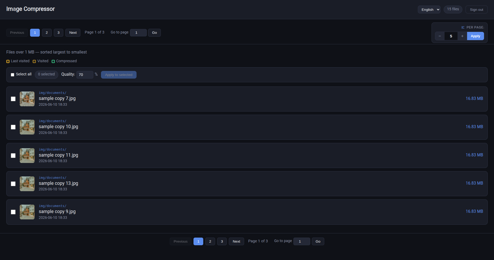
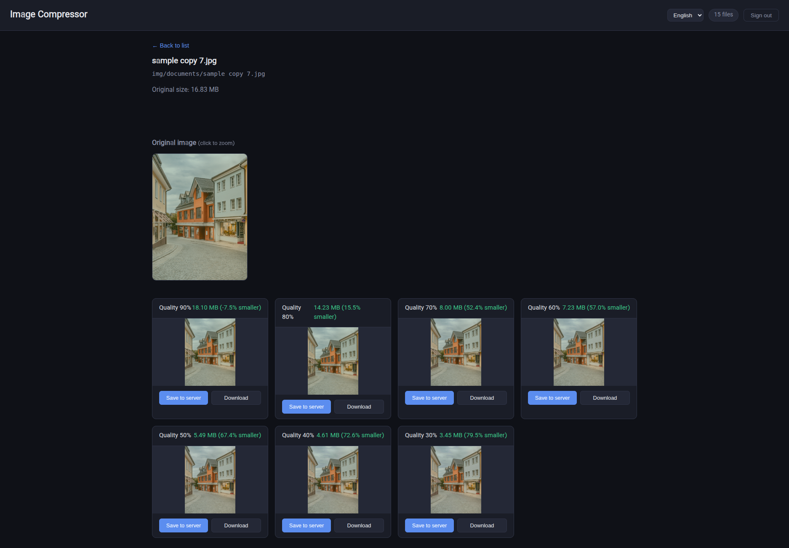

# Image Debt Cleaner

> Scan, preview, and compress oversized images to reclaim storage space in any PHP application.


A drop-in admin tool for PHP projects that have accumulated years of unoptimized image uploads.

No framework required.

No database required.

No ImageMagick required.

No deployment changes required.

copy one folder, set a password, open in the browser.

---

## Demo

**File list** — oversized images sorted by size, bulk selection, and pagination:



**Compression preview** — original image, quality levels, and before/after size comparison:



Example result:

```text
Original Image: 5.8 MB
Compressed:     680 KB
Reduction:      88%
```

Real-world cleanup projects often recover several gigabytes of storage from old uploads.

```text
Largest Images
      ↓
Preview Compression Levels
      ↓
Compare File Sizes
      ↓
Backup Original (optional)
      ↓
Save Optimized Version
```

---
## Quick Start

**Requirements:** PHP 8.1+, Apache/Nginx/built-in server, modern browser.

1. Copy the `img_compressor/` directory to your server
2. Configure the password, allowed_user_agent, and scan_paths in img_compressor/config.example.php.
3. Rename config.example.php to config.php.
4. Open the tool in your browser
5. Start with the largest images
6. Preview results
7. Save optimized versions

---

## Installation

### Directory Structure

Place `img_compressor/` anywhere under your web root — paths are resolved automatically:

```text
public/                          ← document root (auto-detected)
├── img/                         ← scan_paths target
│   └── documents/
├── uploads/
└── admin/tools/img_compressor/  ← tool works here too
```
`scan_paths` are relative to the **document root**, not the tool folder.

---

### Configuration

All settings live in `img_compressor/config.php`. The only required change is the password.

```php
// img_compressor/config.php

'password'              => 'your-secure-password',
'allowed_user_agent'    => 'allowed_user_agent',   //  You can search 'my user agent' on Google."
'scan_paths'            => ['img/', 'uploads/'],   // relative to document root
'min_size_kb'           => 200,                    // ignore files smaller than this
```

**Optional overrides** (only needed behind a reverse proxy or non-standard setup):

 Path resolution (auto-detected by default)
```php
'document_root'      => '/var/www/public',
'base_path'          => '/admin/tools/img_compressor/',
'assets_url_prefix'  => '/',
```

Move secrets to `config.local.php` (see `config.example.php`).

---

### Launch

Open the tool at whatever URL matches its folder:

```text
https://your-domain.com/img_compressor/
https://your-domain.com/admin/tools/img_compressor/
```

---

## Usage

1. **Log in** with the password you configured.
2. **Browse** — images are sorted by size, largest first. Thumbnails load inline.
3. **Preview** — open any image to compare quality levels and see estimated file sizes before saving.
4. **Batch compress** — select multiple images, pick a quality setting, compress all at once.
5. **Save** — optionally create a timestamped backup before overwriting the original.

Compression runs in the browser (Canvas API). The server only handles auth, scanning, backups, and writing the final file — no server-side image library required.

---

## Features at a Glance

| Feature | Details |
|---|---|
| Image discovery | Recursive scan, sort by size, thumbnail preview, configurable threshold |
| Compression preview | Multiple quality presets, before/after size comparison |
| Batch processing | Bulk selection, progress tracking, consistent quality across files |
| Safety | Backup creation, path traversal protection, CSRF tokens, rate-limited login |
| UI | Dark mode, responsive, English + Persian (RTL) |

---

## Project Structure

```text
img_compressor/
├── index.php            # front controller — entry point
├── bootstrap.php        # autoload & dependency wiring
├── config.php           # your settings (gitignored)
├── config.example.php   # all options with comments
├── views/app.php        # HTML shell
├── src/
│   ├── Config/          # AppConfig
│   ├── Domain/          # ImageFile, ByteFormatter
│   ├── Http/            # Request, Router, JsonResponse
│   ├── Application/     # use cases: List, Save, ShowApp
│   └── Infrastructure/  # PathGuard, FileScanner, SessionAuth, I18n
├── lang/
│   ├── en.php
│   └── fa.php
└── assets/
    ├── css/
    ├── js/
    └── backups/
```

---

## API Endpoints

All via `index.php?action=…`:

| Action | Method | Auth | Description |
|---|---|---|---|
| `check` | GET | — | Session status, CSRF token, i18n payload |
| `login` | POST | — | Authenticate |
| `logout` | GET | — | Destroy session |
| `locale` | GET/POST | — | Switch language (`lang=en\|fa`) |
| `files` | GET | ✓ | List oversized images (paginated) |
| `save` | POST | ✓ | Write compressed image (+ optional backup) |
| *(none)* | GET | — | Render the HTML UI |

---

## How It Works

```text
Images On Disk
       │
       ▼
Directory Scan
       │
       ▼
Image Preview
       │
       ▼
Browser Compression
       │
       ▼
Compare Results
       │
       ▼
Create Backup
       │
       ▼
Save Optimized Image
```

Important:

Compression happens in the browser using the Canvas API.

The server handles:

* Authentication
* File scanning
* Backups
* Saving optimized files

No server-side image processing libraries are required.

---

## Architecture

Layered, dependency-free PHP — no framework, no Composer at runtime.

```text
Browser (vanilla JS)
 ├─ Image preview & compression (Canvas API)
 ├─ Bulk operations
 └─ Upload optimized image (base64)
             │
             ▼
img_compressor/
 ├── index.php       → front controller
 ├── bootstrap.php   → wiring & autoload
 ├── views/app.php   → HTML shell
 └── src/
      ├── Http/            → Request, Router, JSON responses
      ├── Application/     → use cases (one action per class)
      ├── Domain/          → ImageFile, formatters
      └── Infrastructure/
           ├── PathGuard   → all filesystem security
           ├── FileScanner → directory scan
           ├── BackupStore → timestamped backups
           └── SessionAuth → login, CSRF, sessions
```

Full design rationale, security model, and extension guide: **[ARCHITECTURE.md](ARCHITECTURE.md)**

---

## Security

**Implemented protections:**

* Password-protected access (`password_hash` / bcrypt supported via `config.local.php`)
* Session-based authentication
* CSRF tokens on login and save
* Login rate limiting (lockout after failed attempts)
* Path traversal protection via `PathGuard` (`realpath` + scan-root validation)
* File type and upload size validation
* HttpOnly + SameSite session cookies; `Secure` flag on HTTPS
* Security headers (CSP, `X-Frame-Options`, etc.)
* `.htaccess` blocks direct access to `config.php`, `bootstrap.php`, `src/`, `views/`, and `lang/`
* Backup directory isolated from web access

**Before production:**

* Move secrets to `config.local.php` (see `config.example.php`)
* Use HTTPS
* Restrict access to administrators (IP allowlist / VPN recommended)
* Limit `scan_paths` to folders you actually need

Recommendations:

* Use HTTPS in production
* Store backups outside public access when possible
* Use a strong password (hashed, not plain text in repo)
* Very large images may hit browser memory limits
* Output format is JPEG only (WebP/AVIF planned)
---

## Contributing

Contributions are welcome.

Bug reports, feature requests, pull requests, and ideas are appreciated.

Please keep the project:

* Lightweight
* Dependency-free
* Easy to deploy
* Framework-agnostic
* Focused on solving image storage debt

---

## Why Open Source?

This project started as a practical solution to a real production problem.

After successfully reducing storage usage in a legacy application, it became clear that many teams face the same challenge:

Years of uploaded images with no optimization strategy.

Instead of keeping the tool private, I decided to share it with the community.

If it helps you recover storage space, simplify backups, or improve performance, then it has achieved its purpose.

---

## License

MIT License